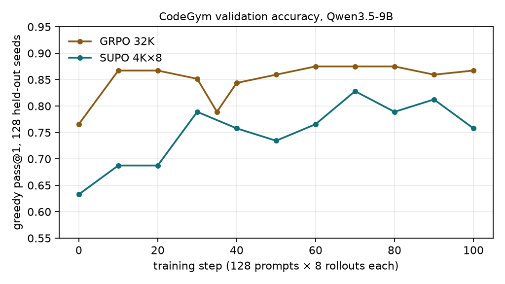
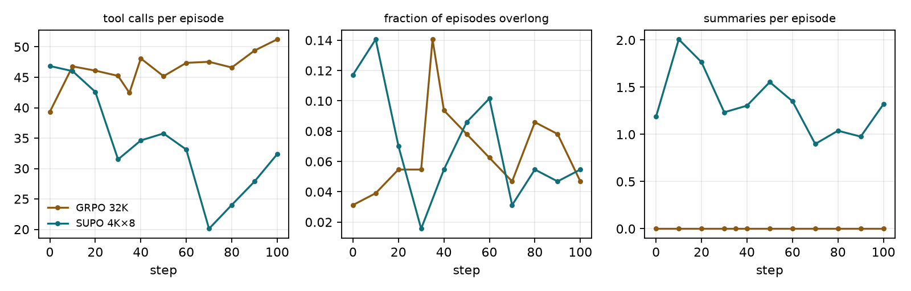

# SUPO Table 1 on CodeGym with Qwen3.5-9B: GRPO-32K vs SUPO-4K×8

*Replication of rows 1 and 4 of Table 1 in "Scaling LLM Multi-turn RL with End-to-end Summarization-based Context Management" (SUPO, arXiv 2510.06727), on CodeGym (arXiv 2509.17325), with Qwen3.5-9B in place of Qwen2.5-32B-Instruct. Runs 2026-09-07 → 2026-09-09 on 1×8 H100 per arm (Merlin/Arnold, ark-eng-algorithm).*

## 1. Question
Does summarization-based context management (SUPO) let a policy trained with a 4K-token working context match a vanilla multi-turn GRPO policy that gets the full 32K context, on CodeGym tool-use tasks? The paper reports 47.7% vs 44.5% (+3.2) for Qwen2.5-32B-Instruct.

## 2. Setup (identical across arms unless noted)
| item | value |
|---|---|
| policy | Qwen3.5-9B, non-thinking, FSDP2 actor + vLLM 0.24 rollouts (8 replicas, TP=1) |
| data | CodeGym (HF VanishD/CodeGym, EN): 12,800 train tasks (≤ 2 per seed problem, oracle ≤ 80 calls); eval = 128 tasks from 128 unseen seeds whose oracle needs 40–90 calls; prompts ≤ 1,536 tokens |
| optimisation | 100 steps = 1 epoch; batch 128 prompts × 8 rollouts; mini-batch 32; 1 PPO epoch; lr 1e-6; clip 0.20/0.28; token-mean loss; no KL, no entropy bonus; `supo` advantage (= GRPO when no summaries) |
| episode limits | 100 LLM calls; 1,024 tokens per turn; 10 no-call turns → overlong; observations as user turns |
| GRPO 32K | working context 32,768; prompt 2,048 / response 30,720; no summaries; fused log-prob kernels + optimizer offload (memory) |
| SUPO 4K×8 | working context 4,096; prompt 4,096 / response 5,120 per trajectory; ≤ 7 summaries (32K effective); summary turn ≤ 1,024 tokens |
| evaluation | greedy pass@1 on the 128 held-out seeds, before training and every 10 steps; reward = CodeGym `Done` verifier |

## 3. Result

| step | 0 | 10 | 20 | 30 | 40 | 50 | 60 | 70 | 80 | 90 | 100 | mean 80–100 |
|---|---|---|---|---|---|---|---|---|---|---|---|---|
| GRPO 32K | 0.766 | 0.867 | 0.867 | 0.852 | 0.844 | 0.859 | 0.875 | 0.875 | 0.875 | 0.859 | **0.867** | 0.867 |
| SUPO 4K×8 | 0.633 | 0.688 | 0.688 | 0.789 | 0.758 | 0.734 | 0.766 | 0.828 | 0.789 | 0.812 | **0.758** | 0.786 |

Noise floor: re-validating the identical GRPO step-35 weights on resume gave 0.789 vs 0.852 at step 30 / 0.844 at step 40 (batched vLLM decoding is not bit-deterministic; ±4 points is one standard error at n=128).

| | GRPO 32K | SUPO 4K×8 | paper GRPO | paper SUPO |
|---|---|---|---|---|
| accuracy before → after | 0.766 → 0.867 | 0.633 → 0.758 (best 0.828 @70; mean of last 3: 0.786) | 0.320 → 0.445 | 0.328 → 0.477 |
| tool calls per eval episode (end) | 51.2 | 32.4 | 52.1 | 54.7 |
| overlong episodes (start → end) | 3% → 5% | 12% → 5% | – | – |
| summaries / trajectories per episode (end) | 0 / 1 | 1.32 / 2.32 | – / – | – / – |
| response tokens per episode (end) | 8,045 | 5,590 | – | – |

**Reading.** Both arms improve substantially (+10 and +12.5 points). With Qwen3.5-9B the 4K×8 SUPO arm does **not** reach the 32K GRPO arm: the gap narrows from 13 points at step 0 to 5–11 points over the last 30 steps (mean of the last three evaluations 0.786 vs 0.867). The paper's qualitative claims that do reproduce: SUPO learns to use summaries (1.3 per episode), overruns its context far less often after training (12% → 5%), and reaches its accuracy with ~35% fewer tool calls than GRPO. The paper's headline claim — SUPO ≥ GRPO at 8× shorter working context — does not reproduce at this model size and step budget. Two caveats cut in SUPO's favour: (i) the 9B base model is already strong with a long context (0.77 at step 0), leaving less headroom for a context-management method; (ii) SUPO's curve is still noisy and rising at steps 70–90 while GRPO is flat, so a longer schedule might close more of the gap.

## 4. Cost and time distribution
| arm | steps/hour | s per step (mean) | rollout gen | actor update | old log-prob | validation (per eval) |
|---|---|---|---|---|---|---|
| GRPO 32K (steps 35–100) | 4.1 | 875 | 571 s (65%) | 245 s (28%) | 46 s (5%) | 330 s |
| SUPO 4K×8 (steps 40–100) | 5.4 | 661 | 534 s (81%) | 93 s (14%) | 20 s (3%) | 290 s |

Generation is bounded by the slowest rollout (max step 1,700–1,850 s in both arms), not by tokens. SUPO's actor update is 2.6× cheaper (10K vs 35K-token sequences); its generation is only marginally cheaper because the summary turns add LLM calls. Full tables: `docs/timing_{grpo,supo}_run{4,5}.md`. Total GPU time ≈ 2 × 8 H100 × ~24 h of training plus ~30 h of shakeout runs.

## 5. What broke and what was fixed (engineering log)
1. Pods run NVIDIA driver R535 (CUDA 12.9 API): verl HEAD's cu130 stack cannot initialise → venv rebuilt on cu129; flash-attn 2.8.3 compiled in-pod (no cu12/torch-2.11 wheel exists).
2. 32K-token PPO updates OOMed at 74 GB → fused linear+log-prob kernels + optimizer offload for the GRPO arm.
3. At 1,024 rollouts/step the vLLM engine died silently twice: FlashInfer JIT-compiling Qwen3.5 GDN kernels with nvcc (memory-cgroup kills of `cicc`) → `gdn_prefill_backend=triton`, FlashInfer sampler off, staggered sandbox spawns, execute-model timeout 1 h.
4. Two agent-loop bugs at scale: missing weight-version tags; zero-token trajectories (post-summary cut-offs and one environment whose code does not parse under Python 3.12 — the official server pins 3.11.2).
5. Checkpoints: 113 GB per save; HDFS fuse writes from the pod ranged 9–125 MB/s; the mirror's verify raced verl's local rotation. Complete checkpoints on HDFS: GRPO steps 35 and 95, SUPO step 40. Both arms were resumed once from HDFS (GRPO from 35, SUPO from 40) after a crash at step 50 caused by item 4.

## 6. Artifacts
- Validation dumps (every prompt, transcript and score): `$PROJECT_ROOT/outputs/<exp>/val/<step>.jsonl`
- Metrics: `docs/report/val_metrics.csv`, `summary.json`; tracking project `supo_codegym` (runs `grpo_codegym_qwen35-9b_32k`, `supo_codegym_qwen35-9b_4kx8`)
- Rerun: `bash scripts/merlin/submit.sh jobs/{grpo,supo}_h100.json` (assets staged on HDFS by `scripts/merlin/stage_assets.sh`); report assets: `python scripts/make_report.py`
- Trace notebook (how an episode works, real traces, the degenerate case): `docs/codegym_trace_notebook.html`
- Code: `~/xiaoxuan/supo_codegym` (git, no remote yet) + patched verl branch `supo` on d040717
