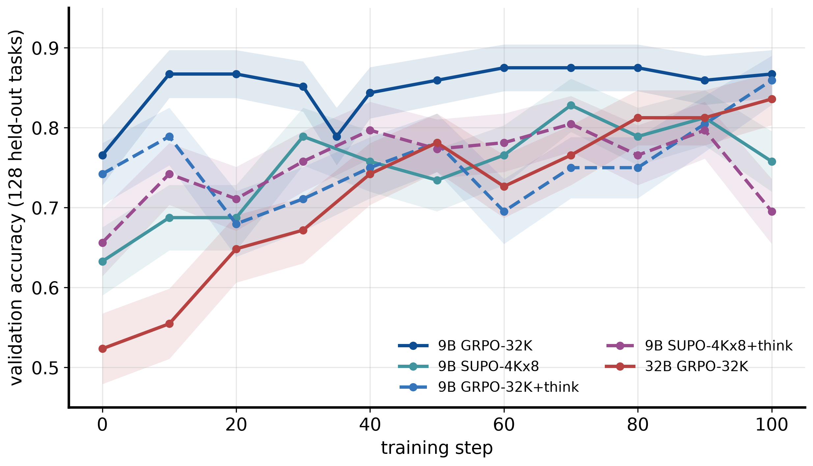
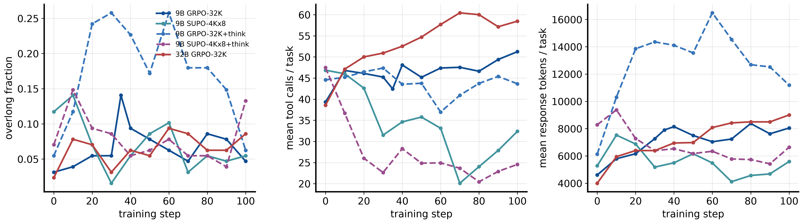
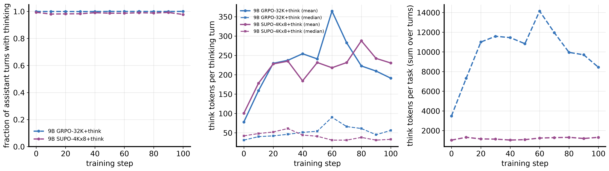
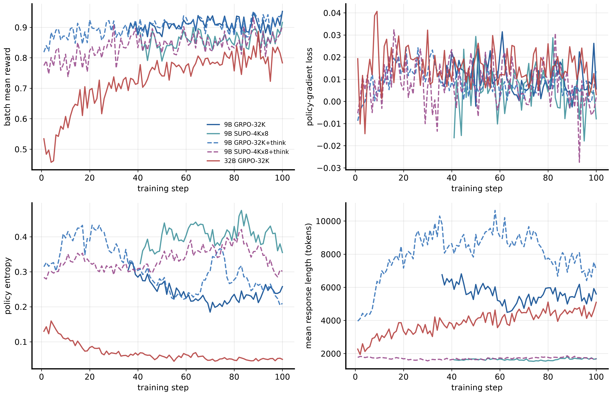
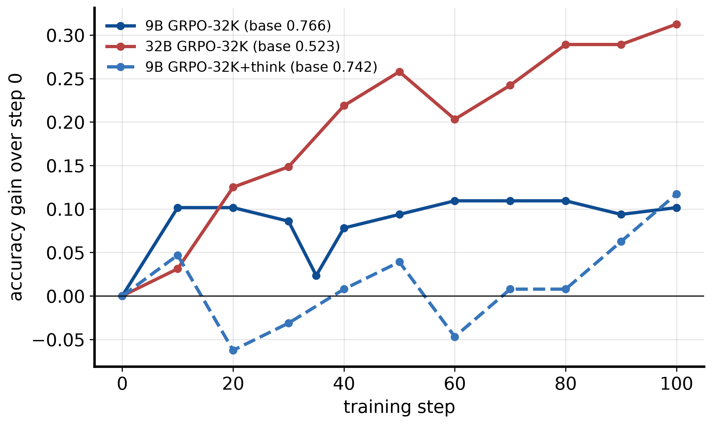
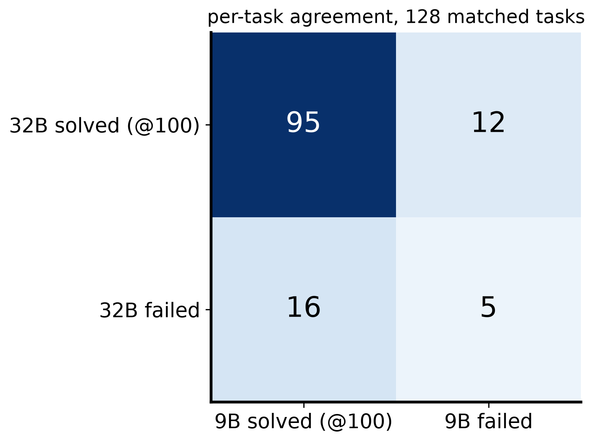

# Thinking mode and a 32B policy on CodeGym

*Two additions to the SUPO Table-1 replication (base report: `docs/report/REPORT.md`). Runs 2026-09-08 to 2026-09-10 (PDT) on the ark-eng-algorithm H100 queue. Built by `scripts/make_report_thinking_32b.py`; every number below comes from `summary.json`, `tables.md` or an `assets/*.csv|json` file. PDF: `REPORT.pdf`.*

## Abstract

We extend the Qwen3.5-9B GRPO-32K vs. SUPO-4K×8 replication with two questions. (A) Does letting the policy think (Qwen3.5 thinking mode, reasoning tokens packed into the trained context) change the outcome of either recipe? (B) How does the papers' model, Qwen2.5-32B-Instruct, behave under the same GRPO-32K recipe on the same 128 held-out tasks? All five arms trained for 100 steps and were evaluated greedily every 10 steps on the same tasks. Thinking does not help: GRPO-32K reaches 0.859 with thinking vs. 0.867 without, SUPO-4K×8 reaches 0.695 vs. 0.758, and GRPO with thinking spends most of the run with 15–26% of episodes truncated at the 32K cap. Qwen2.5-32B-Instruct starts far lower (0.523 vs. 0.766) and gains three times as much from RL (+0.312 vs. +0.102), finishing at 0.836; the two final policies solve 95 of 128 tasks in common and each solves 19 of the 30 tasks the 9B base model failed. Our 32B base accuracy (0.52) is not comparable with the 30.1% in-domain figure of the CodeGym paper, whose evaluation set is filtered to tasks the base model fails.

## 1. Setup

Everything not listed here is identical to §2 of the base report: 12,800 training tasks, 128 held-out tasks from unseen seeds whose oracle needs 40–90 calls, 100 steps of 128 prompts × 8 rollouts, lr 1e-6, clip 0.20/0.28, token-mean loss, no KL or entropy bonus, 100 LLM calls per episode, greedy pass@1 validation every 10 steps, reward from the CodeGym `Done` verifier.

| arm | configuration |
|---|---|
| 9B GRPO-32K, 9B SUPO-4K×8 | base-report arms (run 5): Qwen3.5-9B, `enable_thinking=false`, 1×8 H100 each |
| 9B GRPO-32K+think | `enable_thinking=true`; per-turn cap 4,096 tokens (was 1,024); thinking packed and trained; working context 32,768 (prompt 2,048 / response 30,720); 1×8 H100 |
| 9B SUPO-4K×8+think | as above plus summary-turn cap 2,048 (was 1,024); per-trajectory response 8,192 and `max_model_len` 12,288 (was 5,120 / 10,240); ≤ 7 summaries; 1×8 H100 |
| 32B GRPO-32K | Qwen2.5-32B-Instruct (no thinking in its template), 2×8 H100, FSDP2 + TP4 vLLM rollouts + Ulysses SP4, fused log-prob kernels, optimizer offload; `max_model_len` 32,768 = 2,048 + 30,720 (the model's position limit); checkpoints every 20 steps mirrored per node to HDFS; weights fetched per file from Hugging Face |

**Infrastructure.** One Merlin/Arnold batch job per arm; pods restore a pinned venv (torch 2.11+cu129, vLLM 0.24, flash-attn 2.8.3) and a repo snapshot from HDFS, stage the model locally, start ray (rank 0 head, rank 1 joins over the published IPv4 address), train with `scripts/train_codegym.sh` and mirror checkpoints with `scripts/merlin/ckpt_sync.sh`. Metrics: Merlin tracking project `supo_codegym` (run name = experiment name), https://ml.tiktok-row.net/experiment/tracking/detail?Id=project_20260907_b5e8830b.

**Deviations (honest list).**
- Our evaluation set (128 tasks, 40–90-call oracle band, no accuracy filter, greedy, 100 calls) is not the CodeGym paper's (§5). Standard error at p≈0.8 is ±0.035; differences below ~0.05 are within noise.
- Thinking arms raise the per-turn cap from 1,024 to 4,096 tokens (SUPO's per-trajectory response from 5,120 to 8,192); working contexts are unchanged, so thinking competes with tool calls for the same budget.
- Qwen2.5-32B-Instruct has no thinking switch; its arm is non-thinking by construction.
- The 32B arm trains on 16 GPUs with TP4/SP4 and fused kernels (bf16 hidden states cast to the fp32 lm-head dtype inside the fused cross-entropy kernel); batch and optimizer are identical to the 9B arm.
- Training-log curves of the two non-thinking 9B arms start at step 36/40 (resumed pods; only the resumed log survived). The 9B GRPO arm also has a validation point at step 35 from the pre-resume pod.
- `Codeforces_5537_I__MinPathCostEnv` fails to start under Python 3.12; its episodes are zero-reward fallback rows in all arms.
- No `wandb sync` is possible (byted-wandb overlay logs to Merlin tracking); batch-level curves are parsed from trainer stdout.

## 2. Validation accuracy



*Figure 1. Greedy validation accuracy on the 128 held-out tasks every 10 steps: base arms (solid blue/teal), thinking variants (dashed), Qwen2.5-32B-Instruct GRPO (red). Bands: ±1 standard error sqrt(p(1−p)/128). Each point is the mean `score` over the 128 records of `outputs/<exp>/val/<step>.jsonl`. Data: `assets/fig1_val_acc_all_arms.csv`.*

| arm | 0 | 10 | 20 | 30 | 40 | 50 | 60 | 70 | 80 | 90 | 100 | final | peak | mean 80–100 |
|---|---|---|---|---|---|---|---|---|---|---|---|---|---|---|
| 9B GRPO-32K | .766 | .867 | .867 | .852 | .844 | .859 | .875 | .875 | .875 | .859 | .867 | **.867** | .875 @60 | .867 |
| 9B SUPO-4K×8 | .633 | .688 | .688 | .789 | .758 | .734 | .766 | .828 | .789 | .812 | .758 | **.758** | .828 @70 | .786 |
| 9B GRPO-32K+think | .742 | .789 | .680 | .711 | .750 | .781 | .695 | .750 | .750 | .805 | .859 | **.859** | .859 @100 | .805 |
| 9B SUPO-4K×8+think | .656 | .742 | .711 | .758 | .797 | .773 | .781 | .805 | .766 | .797 | .695 | **.695** | .805 @70 | .753 |
| 32B GRPO-32K | .523 | .555 | .648 | .672 | .742 | .781 | .727 | .766 | .812 | .812 | .836 | **.836** | .836 @100 | .820 |

**Thinking verdict.** Enabling thinking changes the final accuracy by −0.008 for GRPO-32K (within noise) and −0.063 for SUPO-4K×8. Over the last three checkpoints, the more robust summary, thinking costs 0.062 for GRPO (0.867 → 0.805) and 0.033 for SUPO (0.786 → 0.753). The thinking GRPO arm is also slower: median step 946 s vs. 794 s.

**32B vs. 9B.** Qwen2.5-32B-Instruct goes from 0.523 to 0.836 (+0.312); Qwen3.5-9B from 0.766 to 0.867 (+0.102). The 32B curve is still rising at step 100 (0.812, 0.812, 0.836) while the 9B curve is flat from step 10.

## 3. Behaviour: truncation, tool calls, thinking length



*Figure 2. Per-checkpoint validation behaviour (mean over 128 episodes). Left: fraction of episodes flagged overlong (100-call limit, working-context limit, or ten consecutive turns without a call). Middle: tool calls per episode. Right: generated tokens per episode (thinking included). GRPO+think truncates 15–26% of episodes between steps 20 and 90 at ~11K tokens per episode; non-thinking GRPO stays at 3–9% and ~8K. Data: `assets/fig2_overlong_calls_tokens.csv`.*

| arm | overlong @0 | overlong @100 | tool calls @0 | tool calls @100 | summaries @100 | median step (s) |
|---|---|---|---|---|---|---|
| 9B GRPO-32K | 0.03 | 0.05 | 39.3 | 51.2 | 0.00 | 794 |
| 9B SUPO-4K×8 | 0.12 | 0.05 | 46.9 | 32.4 | 1.32 | 539 |
| 9B GRPO-32K+think | 0.05 | 0.06 | 44.6 | 43.6 | 0.00 | 946 |
| 9B SUPO-4K×8+think | 0.07 | 0.13 | 47.5 | 24.6 | 1.98 | 551 |
| 32B GRPO-32K | 0.02 | 0.09 | 38.6 | 58.5 | 0.00 | 639 (16 GPUs) |



*Figure 3. Thinking statistics of the two thinking arms per checkpoint, from the greedy validation outputs (`output` field: decoded generation including chat-template role text; turns split on the template's `assistant` marker). A turn is a thinking turn when the text before its `</think>` tag (opening tag removed; the template supplies it for the first turn) is non-empty, or when a think block is opened but never closed (cut by the 4,096-token per-turn cap). Think tokens are counted with the Qwen3.5-9B tokenizer. Left: 99–100% of GRPO+think turns and 96–99% of SUPO+think turns think; the non-thinking control arms measure exactly 0. Middle: mean (solid) and median (dashed) think tokens per thinking turn; the median stays at 30–60 while the mean grows from 78 (step 0) to 240–360 (steps 40–60) and back to 191 (step 100) for GRPO+think (p90 up to 610, max 4,140 = the cap). Right: think tokens per validation episode: 3.5K at step 0, 8–14K mid-run for GRPO+think. Limitation: for SUPO the `output` field holds only the final working-context segment of each episode, so its totals cover that segment only. Data: `assets/fig3_thinking_stats.csv`.*

The mechanism behind the GRPO+think dip: thinking grows from step 10, generation reaches ~11K tokens per episode, more episodes overrun the 32K window and are masked out of the loss, and accuracy falls to 0.68–0.75. Between steps 60 and 100 mean think length shrinks (361 → 191 tokens per thinking turn), truncation falls from 26% to 6%, and accuracy recovers to 0.859. SUPO absorbs the extra tokens through summarization, so its truncation stays low, but its thinking policy makes fewer calls (24.6 vs. 32.4) and scores lower.

## 4. Training curves



*Figure 4. Batch-level metrics from each arm's trainer stdout (`step:N - key:value` lines, ray/ANSI prefixes stripped, last occurrence per step). Top left: batch mean reward (`critic/score/mean`, 128 × 8 rollouts at temperature 1). Top right: policy-gradient loss. Bottom left: policy entropy. Bottom right: mean generated tokens per rollout. The 9B non-thinking curves start at step 36/40 (resumed pods). The 32B policy has much lower entropy from the start (0.13 → 0.05) than the 9B policies (0.26–0.43) and its response length grows steadily (2.3K → 5.1K) as it learns to make more calls (38.6 → 58.5 on validation). GRPO+think produces the longest rollouts (up to 10.6K tokens at step 58). Data: `assets/fig4_training_curves.csv`.*

## 5. 32B vs. 9B on the same tasks, and the CodeGym paper





*Figure 5 (top). Accuracy gain over each arm's own step-0 accuracy: +0.31 for 32B vs. +0.10 for 9B, from a base 0.24 lower. Figure 6 (bottom). Solved/unsolved contingency between the final 32B and 9B GRPO policies on the 128 tasks, matched across runs by an MD5 of the validation prompt text with role markers, thinking scaffolds and whitespace removed (128/128 matched): both solve 95, only 9B 16, only 32B 12, neither 5. Of the 30 tasks the 9B base model failed at step 0, the final 9B policy solves 19 and the final 32B policy also solves 19. Data: `assets/fig5_gain_over_base.csv`, `assets/fig6_task_agreement.json`.*

| | CodeGym paper (arXiv 2509.17325) | this report |
|---|---|---|
| evaluation set | 500 unseen environments, 972 task configurations | 128 unseen seed problems, 128 tasks |
| difficulty filter | 10–256 required tool calls and base-model accuracy ≤ 25% | oracle 40–90 calls; no accuracy filter |
| decoding | temperature 0.7, top-p 0.95, pass@1 | greedy, one attempt |
| tool-call budget | 256 (512 hard) | 100 |
| context | 5,120 prompt + 24,576 response | 2,048 + 30,720 |
| training | GRPO, 512 × 8, ~100 steps | GRPO, 128 × 8, 100 steps |
| Qwen2.5-32B-Instruct | 30.1 → 81.0 (filtered data) / 75.0 (unfiltered) | 0.523 → 0.836 |

The paper's ≤ 25% accuracy screen fixes the base score near the screening threshold by construction, and its 50-point gain is measured on tasks selected because the base model fails them. Our set never removes tasks the base model solves, so a strong model starts high; the 32B base at 0.52 (0.39–0.50 in earlier two-step smoke runs) is the same model on a less adversarial pool with greedy decoding. A direct number against the paper needs an evaluation split with both of its filters and a re-score of the saved checkpoints (32B steps 80/100, 9B steps 95/100 are on HDFS): a data-preparation change, not a retrain.

## 6. Example trajectories

Excerpts (tool outputs truncated, long runs elided) from `assets/traj_*.txt`; records in `trajectories.json`.

**32B, step 0, failure (sampled training rollout).** Follows the protocol but merges one character at a time and submits a wrong answer after 62 calls.

```
env: Leetcode_31007_I__StringMergeEnv
config: {"word1": "abcdefghijklmnopqrstuvwxyz", "word2": "123"}
reward=0.0 finished=True overlong=False stop=done tool_calls=62 summaries=0 steps=62
--- trajectory 1/1 (prompt 849 tok, response 7864 tok)
task: Please answer the following question step by step according to the requirements below! 1. **Do not** write code to answer the user's question — you may only call the provided functions, and you may call at most **one function per step**. 2. After you call a function, wait for the tool to return the result — do not assume what the result will be. 3. If the tool’s description is unclear, you can try using it first, and then adjust your function call based on the returned result. 4. Function calls should be wrapped with `<|FunctionCallBegin|>....<|FunctionCallEnd|>` and contain a JSON-formatted l
  A1: To begin with, let's observe the current environment state to understand what strings we are dealing with. <|FunctionCallBegin|>[{"name": "Observe", "parameters": {}}]<|FunctionCallEnd|>
  obs: Current environment: word1 and word2 are ready, merged list not created
  A2: The environment indicates that the strings `word1` and `word2` are ready, but the merged list has not been created yet. Let's create the merged list now. <|FunctionCallBegin|>[{"name": "CreateMergedList", "parameters": {}}]<|FunctionCallEnd|>
  obs: New merged list has been created
  A3: The merged list has been successfully created. Next, we need to get the lengths of `word1` and `word2` to determine how many characters we need to process. <|FunctionCallBegin|>[{"name": "GetStringLength", "parameters": {"string_name": "word1"}}]<|FunctionCallEnd|>
  obs: 26
  A4: The length of `word1` is 26. Now, let's get the length of `word2`. <|FunctionCallBegin|>[{"name": "GetStringLength", "parameters": {"string_name": "word2"}}]<|FunctionCallEnd|>
  obs: 3
  A5: The length of `word2` is 3. Now we know the lengths of both strings. We will start merging the strings by taking characters alternately from `word1` and `word2`. Let's start with the first character of `word1`. <|FunctionCallBegin|>[{"name": "GetCharacterAtPosition", "parameters": {"string_name": "word1", "position": 0}}]<|FunctionCallEnd|>
  obs: a
  A6: The first character of `word1` is 'a'. Now, let's ad
  ... [elided] ...
', '2']. Next, we will get the third character of `word1` and add it to the merged list. <|FunctionCallBegin|>[{"name": "GetCharacterAtPosition", "parameters": {"string_name": "word1", "position": 2}}]<|FunctionCallEnd|>
  obs: c
  A14: The third character of `word1` is 'c'. Now, let's add this character to the merged list. <|FunctionCallBegin|>[{"name": "AddCharacterToList", "parameters": {"character": "c"}}]<|FunctionCallEnd|>
  obs: Character 'c' has been added to the merged list, current list: ['a', '1', 'b', '2', 'c']
  ... (assistant turns elided) ...
  A62: The merged string is "a1b2cdefghijklmnopqrstuvwxyz". Now, let's verify whether this is the correct final answer. <|FunctionCallBegin|>[{"name": "Done", "parameters": {"answer": "a1b2cdefghijklmnopqrstuvwxyz"}}]<|FunctionCallEnd|>
```

**32B, step 100, success.** Same environment as the failure below (two rollouts of one prompt in the step-100 batch): recovers from a malformed first call, plans the full search, submits the right answer after 79 calls.

```
env: Codeforces_38332_I__MinLandMassesEnv
config: {"n": 5, "m": 7, "grid": [["L", "W", "L", "L", "L", "W", "L"], ["L", "L", "L", "W", "L", "L", "L"], ["W", "L", "W", "L", "W", "L", "W"], ["L", "L", "L",
reward=1.0 finished=True overlong=False stop=done tool_calls=79 summaries=0 steps=80
--- trajectory 1/1 (prompt 687 tok, response 9450 tok)
task: Please answer the following question step by step according to the requirements below! 1. **Do not** write code to answer the user's question — you may only call the provided functions, and you may call at most **one function per step**. 2. After you call a function, wait for the tool to return the result — do not assume what the result will be. 3. If the tool’s description is unclear, you can try using it first, and then adjust your function call based on the returned result. 4. Function calls should be wrapped with `<|FunctionCallBegin|>....<|FunctionCallEnd|>` and contain a JSON-formatted l
  A1: To solve this problem, we need to follow these steps: 1. **Observe the Initial Grid**: Use the `Observe()` function to get the current state of the grid. 2. **Count Initial Landmasses**: Use the `CountLandMasses()` function to find the initial number of landmasses in the grid. 3. **Iterate Over Each Land Cell**: For each land cell ('L') in the grid: - Temporarily change the cell to water ('W') using the `ChangeLandTo
  obs: Error: The action cannot be parsed in json format: Unterminated string starting at: line 1 column 37 (char 36)
  A2: It appears there is an error due to an incorrect format in the function call. Let's correct the format and call the `Observe()` function again to get the current state of the grid. <|FunctionCallBegin|>[{"name": "Observe", "parameters": {}}]<|FunctionCallEnd|>
  obs: [["L", "W", "L", "L", "L", "W", "L"], ["L", "L", "L", "W", "L", "L", "L"], ["W", "L", "W", "L", "W", "L", "W"], ["L", "L", "L", "W", "L", "L", "L"], ["L", "W", "L", "L", "L", "W", "L"]]
  A3: The current state of the grid is as follows: ``` L W L L L W L L L L W L L L W L W L W L W L L L W L L L L W L L L W L ``` Next, we need to count the initial number of landmasses in this grid. Let's use the `CountLandMasses()` function for this purpose. <|FunctionCallBegin|>[{"name": "CountLandMasses", "parameters": {}}]<|FunctionCallEnd
  ... [elided] ...
, 4)`. We will change the land cell at `(0, 4)` to water, count the number of landmasses, and then reset the grid. Let's start by changing the land cell at `(0, 4)` to water. <|FunctionCallBegin|>[{"name": "ChangeLandToWater", "parameters": {"row": 0, "col": 4}}]<|FunctionCallEnd|>
  obs: Successfully changed the land at (0,4) to water
  ... (assistant turns elided) ...
  A80: The grid has been successfully reset to its initial state. We have now iterated through all the land cells and recorded the number of landmasses after changing each one to water. The minimum number of landmasses found after changing one land cell to water is **1**. This minimum was achieved when we changed the land cell at `(2, 3)` to water. Now, we will verify the final answer using the `Done()` function. <|Function
```

**32B, step 100, failure.** The sibling rollout re-observes the grid after every reset, exhausts the 100-call budget (overlong) and never submits.

```
env: Codeforces_38332_I__MinLandMassesEnv
config: {"n": 5, "m": 7, "grid": [["L", "W", "L", "L", "L", "W", "L"], ["L", "L", "L", "W", "L", "L", "L"], ["W", "L", "W", "L", "W", "L", "W"], ["L", "L", "L",
reward=0.0 finished=False overlong=True stop=max_steps tool_calls=99 summaries=0 steps=100
--- trajectory 1/1 (prompt 687 tok, response 16102 tok)
task: Please answer the following question step by step according to the requirements below! 1. **Do not** write code to answer the user's question — you may only call the provided functions, and you may call at most **one function per step**. 2. After you call a function, wait for the tool to return the result — do not assume what the result will be. 3. If the tool’s description is unclear, you can try using it first, and then adjust your function call based on the returned result. 4. Function calls should be wrapped with `<|FunctionCallBegin|>....<|FunctionCallEnd|>` and contain a JSON-formatted l
  A1: To solve this problem, we need to follow these steps: 1. **Observe the initial grid state**: We need to know the current configuration of the grid. 2. **Count the initial number of landmasses**: This gives us a baseline to compare future changes. 3. **Iterate over each land cell in the grid**: For each land cell, we will: - Change the land cell to water. - Count the number of landmasses after the change. - Record the
  obs: Error: The action cannot be parsed in json format: Unterminated string starting at: line 1 column 37 (char 36)
  A2: It appears there's an error due to an incorrect format in the function call. Let's correct that and try calling the `Observe` function again to get the initial grid state. <|FunctionCallBegin|>[{"name": "Observe", "parameters": null}]<|FunctionCallEnd|>
  obs: [["L", "W", "L", "L", "L", "W", "L"], ["L", "L", "L", "W", "L", "L", "L"], ["W", "L", "W", "L", "W", "L", "W"], ["L", "L", "L", "W", "L", "L", "L"], ["L", "W", "L", "L", "L", "W", "L"]]
  A3: The initial grid state is: ``` L W L L L W L L L L W L L L W L W L W L W L L L W L L L L W L L L W L ``` Next, we need to count the initial number of landmasses in this grid to establish a baseline. <|FunctionCallBegin|>[{"name": "CountLandMasses", "parameters": null}]<|FunctionCallEnd|>
  obs: 2
  A4: The initial number of landmasses in
  ... [elided] ...
nge to restore the original state of the grid. Let's revert the change by resetting the grid. <|FunctionCallBegin|>[{"name": "ResetGrid", "parameters": null}]<|FunctionCallEnd|>
  obs: Grid has been reset to initial state
  A14: The grid has been successfully reset to its initial state. Now, we will proceed to the next cell to check if changing it to water results in a smaller number of landmasses. The next cell to check is (0, 3). Let's first observe the current grid state to confirm: <|FunctionCallBegin|>[{"name": "Observe", "parameters": null}]<|FunctionCallEnd|>
  obs: [["L", "W", "L", "L", "L", "W", "L"], ["L", "L", "L", "W", "L", "L", "L"], ["W", "L", "W", "L", "W", "L", "W"], ["L", "L", "L", "W", "L", "L", "L"], ["L", "W", "L", "L", "L", "W", "L"]]
  ... (assistant turns elided) ...
```

**9B GRPO-32K+think, step 100, validation episode with packed thinking.** First four turns of the first solved task; the first think block is opened by the template and runs long, later turns think a sentence or two before each call.

```
source: greedy validation output, grpo_codegym_qwen35-9b_32k_think @ step 100, first solved task (score=1)
  turn 1 <think> The user wants me to find the maximum rectangular area that can be formed by consecutive buildings, where each building has width 1, and the height of the rectangle is determined by the minimum height among the buildings in that rectangle. This is a classic problem known as "Largest Rectangle in Histogram" problem. The standard solution uses a stack-based approach: 1. We iterate through all buildings 2. We maintain a stack of indices where heights are in increasing order 3. When we encounter a b ... </think>
  turn 1 answer: 
  turn 2 <think> I need to start solving the problem. Let me first understand what I need to do: 1. This is the "Largest Rectangle in Histogram" problem 2. I need to use a stack-based approach 3. I need to call functions step by step Let me start by: 1. First, I should initialize the stack 2. Get the length of the building heights array 3. Then I can start processing Let me start: Step 1: Initialize stack Step 2: Get length of heights array Let me call InitializeStack() first. </think>
  turn 2 answer: <|FunctionCallBegin|>[{"name": "InitializeStack", "parameters": {}}]<|FunctionCallEnd|>
  obs: Stack has been initialized
  turn 3 <think> Good! Stack is initialized. Now I need to get the length of the building heights array. </think>
  turn 3 answer: <|FunctionCallBegin|>[{"name": "GetLength", "parameters": {}}]<|FunctionCallEnd|>
  obs: 7
  turn 4 <think> Great! The length is 7. So we have 7 buildings. Now I need to: 1. Get the heights of all buildings to understand the problem 2. Implement the stack-based algorithm Let me first get all the heights to understand the problem better. I should get height at each index from 0 to 6. Let me start by getting height at index 0: </think>
  turn 4 answer: <|FunctionCallBegin|>[{"name": "GetHeight", "parameters":{"index": 0}}]<|FunctionCallEnd|>
  obs: 0
```

## 7. Incident log and timeline (PDT)

- **Sep 8 16:03** thinking arms launched (1×8 H100 each); both ran uninterrupted to step 100 (SUPO+think done Sep 9 10:09, GRPO+think Sep 9 20:31); final checkpoints mirrored.
- **Sep 8 19:00 – Sep 9 13:00** sixteen 2-node smoke runs for the 32B arm, each exposing one defect: huggingface_hub snapshot download hanging at ~31 GB (per-file curl); `max_model_len` above the model's 32,768 positions; ray head failing silently on the allocated port (port fallbacks, worker ports 30000–39999); wandb "No API key" because ray daemons started before the env exports; a verl bug passing the fp32 lm-head weight with bf16 hidden states to the fused cross-entropy kernel (`dense_common`, cast added); on A100 pods an InfiniBand GPU-Direct registration error (`NCCL_NET_GDR_LEVEL=LOC`) and a whole rack of IPv6-only pods (fail-fast preflight); a stale `DONE` marker in the shared run directory making rank 1 leave the ray cluster at start (per-trial markers); verl's driver actor landing on rank 1 so rank 0 never saw the checkpoint tracker (readiness now from each node's own shards); HDFS-fuse dropping appends from a second writer (pod-local sync log with single-writer copy); mawk printing the 196 GB byte sum in scientific notation, aborting the upload in bash arithmetic (printf %.0f).
- **Sep 9 10:47** the H100 smoke that waited 13 h in the queue trained correctly (val 0.500/0.523/0.484 over two steps).
- **Sep 9 13:27** queued smoke converted into the full run at the user's request; pods after 92 min; trainer up 15:06; 8–11 min per step.
- **Sep 9 18:34** first live checkpoint (step 20) mirrored from both nodes in 450 s (433–438 MB/s via the fuse fallback after the HDFS CLI puts failed fast with an empty error); steps 40/60/80/100 likewise (399–463 MB/s).
- **Sep 10 09:49** 32B run exited cleanly; checkpoints 80 and 100 complete on HDFS.

**Open items.** HDFS CLI puts fail immediately on the 32B pods (empty error; fuse fallback carried every upload). The IPv6-only preflight may be over-strict now that the stale-marker bug behind the "IPv6 hang" is fixed. A paper-protocol evaluation split would enable a direct comparison with the CodeGym paper; re-scoring the saved checkpoints on it is straightforward.

## 8. Discussion and limitations

- **Thinking is not free context.** With a fixed 32K window, a policy that thinks 3–14K tokens per episode leaves less room for calls and observations; GRPO's reward then pushes it to think less, and only then does accuracy recover. SUPO's summaries hide the cost from the context but not from the policy: the thinking SUPO arm makes fewer calls and scores lower. On CodeGym, where the useful reasoning is a short plan followed by many cheap calls, thinking buys nothing at this scale.
- **Model comparison.** Qwen2.5-32B-Instruct is a weaker tool user than Qwen3.5-9B at step 0 (0.52 vs. 0.77) and stays 3 points behind after 100 steps, but it is still improving and solves 12 tasks the 9B policy does not. Whether it overtakes with more steps is untested.
- **Noise.** Single greedy runs on 128 tasks (±0.035 at p=0.8); peaks and single-checkpoint differences below 0.05 are not real; the 80–100 means and full curves are the reliable summaries.
- **Attribution.** Thinking statistics come from the decoded validation text and a tag-based split; they cannot separate useful from idle thinking. The thinking-length/overlong/accuracy link is a co-movement over checkpoints, not a controlled ablation.
- **Comparability with the papers** is limited to direction and gain size (§5).
